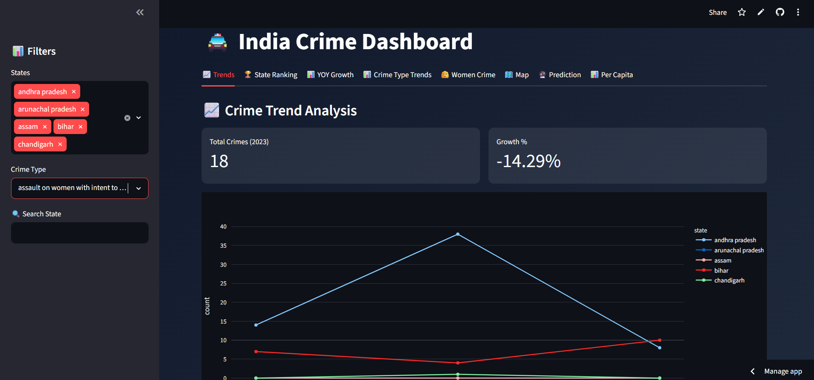
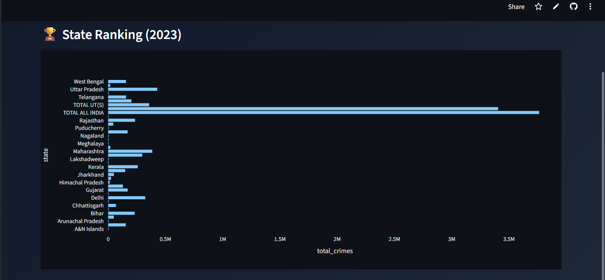
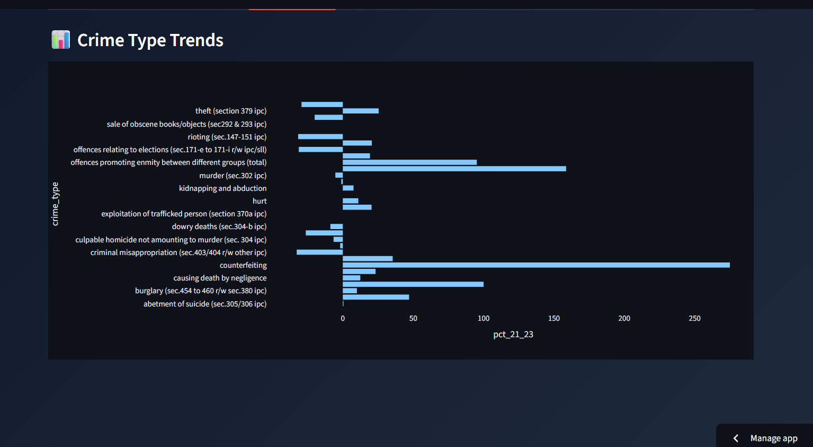
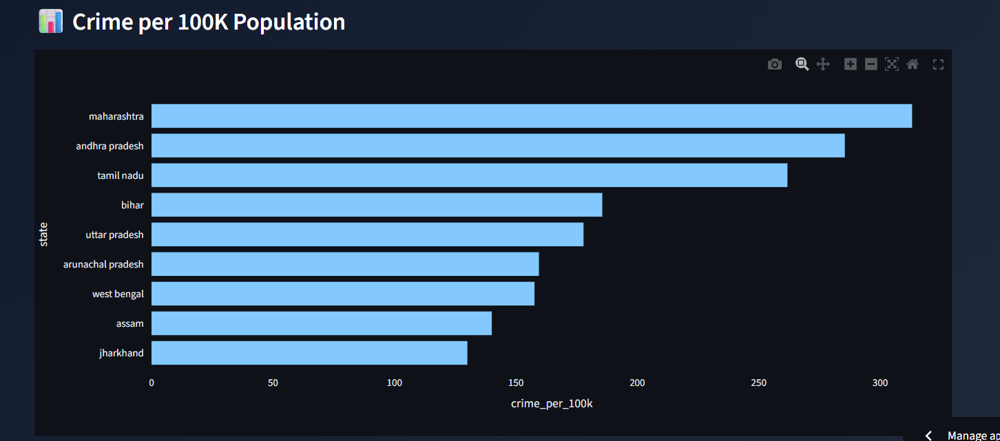

<div align="center">


<br/>

**An interactive data analytics dashboard built on NCRB crime data (2021–2023), covering state rankings, crime type trends, women crime analysis, per capita rates, and growth-based trend extrapolation.**

<br/>

[](https://india-crime-dashboard-s3nmqhlxqnxjze74yj2vdn.streamlit.app/)
[](https://python.org/)
[](https://pandas.pydata.org/)
[](https://plotly.com/)
[](https://streamlit.io/)

</div>

---

## 📸 Screenshots

| Crime Trend Analysis | State Ranking (2023) |
|---------------------|----------------------|
|  |  |

| Crime Type Growth | Per Capita Crime Rate |
|------------------|-----------------------|
|  |  |

---

## 📊 What It Covers

8 interactive views, all filterable by state and crime type:

| Tab | What It Shows |
|-----|--------------|
| 📈 Trends | Year-wise crime count per state with YoY growth % |
| 🏆 State Ranking | States ranked by total crimes in 2023 |
| 📊 YOY Growth | % change in crime volume per state (2021–2023) |
| 📉 Crime Type Trends | Growth rates across specific IPC crime categories |
| 👩 Women Crime | Women crime percentage by state |
| 🗺️ Map | Geographic distribution of crime across India |
| 🔭 Trend Extrapolation | Forward projection based on 2021–2023 growth rates |
| 👤 Per Capita | Crime per 100K population — removes population size bias |

---

## 🗃️ Dataset

- **Source:** National Crime Records Bureau (NCRB), Government of India
- **Coverage:** All Indian states and UTs, 2001–2023
- **Crime types:** IPC categories including murder, theft, kidnapping, dowry deaths, counterfeiting, women crimes, and more
- **Normalization:** Per capita analysis uses state-level population data to remove population size bias

---

## 🛠️ Tech Stack

| Layer | Technology |
|-------|-----------|
| Language | Python 3 |
| Dashboard | Streamlit |
| Data processing | Pandas, NumPy |
| Visualizations | Plotly Express |
| Deployment | Streamlit Cloud |

---

## 🚀 Local Setup

```bash
# Clone
git clone https://github.com/arka562/india-crime-dashboard.git
cd india-crime-dashboard

# Install dependencies
pip install -r requirements.txt

# Run
streamlit run app.py
```

---

## 📁 Project Structure

```
india-crime-dashboard/
├── app.py                  # Main Streamlit app
├── crime_model.py          # Trend extrapolation logic
├── data/
│   └── crime_data.csv      # NCRB dataset (2001–2023)
├── screenshots/
└── requirements.txt
```

---

## ⚠️ Limitations

- **Trend extrapolation is not ML** — it projects forward using the 2021–2023 growth rate. This assumes that short-term trend continues, which may not hold. Treat projections as directional, not predictive.
- **2-year base window (2021–2023)** is narrow. Projections are sensitive to anomalies in those specific years (e.g., COVID-period distortions in 2021).
- **NCRB data reflects reported crimes only** — actual crime rates may differ due to underreporting, especially for women crimes.

---

## 👤 Author

**Arkaprava Ghosh**  
B.Tech IoT & Intelligent Systems, Manipal University Jaipur

[](https://linkedin.com/in/your-link)
[](https://github.com/arka562)
[](mailto:your-email@gmail.com)

---

<div align="center">
  <sub>Data source: NCRB Annual Reports — publicly available at ncrb.gov.in</sub>
</div>
